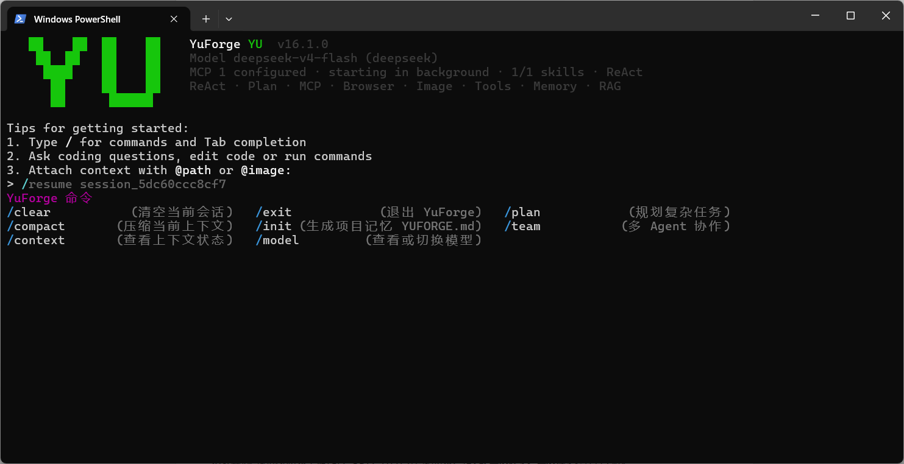
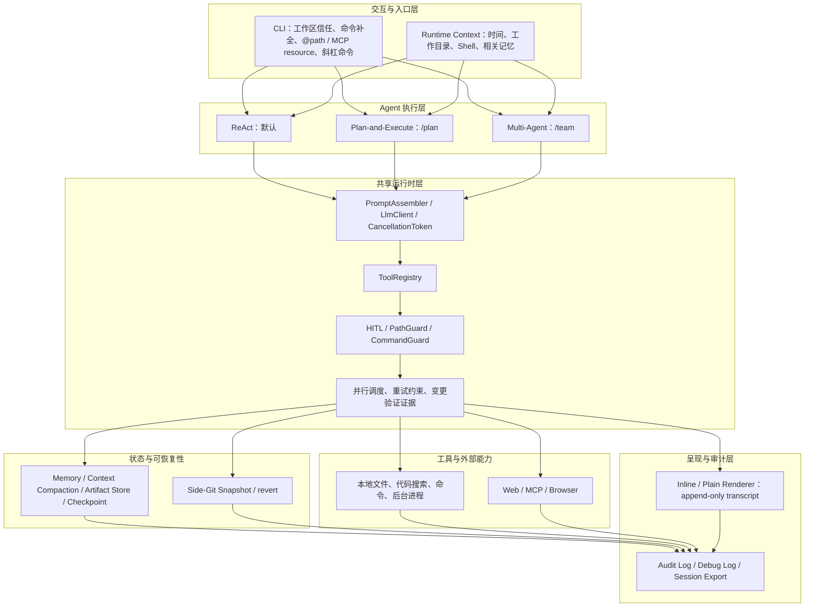

# YuForge

> A production-minded Java Code Agent CLI for real codebases.

面向真实代码库任务的 Java Code Agent CLI。YuForge 的目标不是把大模型包成聊天窗口，而是让 Agent 能在受控边界内完成 **理解 → 规划 → 修改 → 验证** 的开发闭环。


[快速开始](#快速开始) · [核心能力](#核心能力) · [MCP](#mcp) · [架构](#架构概览) · [安全边界](#安全边界) · [贡献与验证](#开发与验证)



## 为什么是 YuForge

| 真实问题 | YuForge 的处理方式 |
| --- | --- |
| 长任务越跑越长，简单滑动窗口会丢失工具结果 | 大工具结果归档 + 可按 `artifact_id` 恢复；按 user turn 进行结构化压缩 |
| 动态 system prompt 降低 Prompt Cache 命中 | 稳定 system prefix；时间、工作目录、检索记忆进入当前 user turn |
| 网页/MCP 内容可能携带恶意指令 | 不可信来源标记 + HITL + PathGuard/CommandGuard + 显式记忆写入授权 |
| Agent 修改了代码却无法证明完成 | 改动后区分“已修改”和“已验证”；构建、测试、ready 或回读才形成证据 |
| Windows Terminal 缩放后终端错乱 | 默认 append-only transcript，不依赖相对光标重绘、右提示或动态 dock |

## 核心能力

- **Code Agent Runtime**：ReAct 为默认执行路径；复杂任务可切换 `/plan` 或 `/team`。Team Planner 会先用有界只读工具理解工作区，再输出 DAG 计划；格式异常时自动修复一次，写入与命令只交给 Worker。
- **真实代码库探索**：`glob_files → grep_code → read_file` 的实时探索路径；RAG 仅作为模糊语义检索补充。
- **长上下文与记忆**：工具结果归档恢复、结构化压缩、项目级 `YUFORGE.md`、长期记忆和 checkpoint 会话恢复。
- **安全工具调用**：工作区信任、HITL、PathGuard、CommandGuard、审计日志与 Prompt Injection 防护。
- **MCP 与浏览器**：stdio / Streamable HTTP MCP、动态工具与 resources、Chrome DevTools MCP。
- **稳定 CLI**：JLine 命令补全、可取消任务、折叠工具摘要和跨平台 `yuforge` 命令；提交后立即显示 Thinking，结束保留分段耗时，代码块轻量语法高亮，每轮以 `model · workspace` footer 收束。

## 快速开始

### 1. 安装

每个 [GitHub Release](../../releases) 都包含 shaded jar、SHA-256 校验文件和 Windows/macOS/Linux 安装脚本。安装后会将 `yuforge` 加入当前用户 PATH；用户不需要安装 Maven。

Windows PowerShell：

```powershell
irm https://github.com/gxySkywalker/YuForge/releases/latest/download/install.ps1 | iex
# 重新打开终端后：
yuforge
```

macOS / Linux：

```bash
curl -fsSL https://github.com/gxySkywalker/YuForge/releases/latest/download/install.sh | sh
# 重新打开终端后：
yuforge
```

从源码安装：

```powershell
git clone https://github.com/gxySkywalker/YuForge.git
cd YuForge
mvn clean package
powershell -ExecutionPolicy Bypass -File scripts\install.ps1
```

### 2. 配置 API Key

只需要 Java 17+ 和至少一个模型 API Key。无需同时配置全部 provider；例如只使用 DeepSeek 时，只配置 `DEEPSEEK_API_KEY` 即可。

推荐选择一种配置方式：

| 方式 | 适用场景 | 位置 |
| --- | --- | --- |
| 项目级 `.env` | 不同项目使用不同 Key | 当前项目根目录 `.env` |
| 用户环境变量 | 所有项目复用同一 Key | 用户环境变量；新终端生效 |

项目级 `.env` 示例：

```dotenv
DEEPSEEK_API_KEY=your_api_key
DEEPSEEK_MODEL=deepseek-v4-flash
```

Windows 用户环境变量示例：

```powershell
[Environment]::SetEnvironmentVariable('DEEPSEEK_API_KEY', 'your_api_key', 'User')
[Environment]::SetEnvironmentVariable('DEEPSEEK_MODEL', 'deepseek-v4-flash', 'User')
```

支持 `GLM_API_KEY`、`DEEPSEEK_API_KEY`、`STEP_API_KEY`、`KIMI_API_KEY`、`FREELLMAPI_API_KEY`、`XFYUN_MAAS_API_KEY` 和 `AGNES_API_KEY`。优先级为：`~/.yuforge/config.json` 显式配置 → 系统/用户环境变量 → 当前项目 `.env` → `~/.env`。

### 3. 在项目目录中启动

```powershell
cd C:\code\your-project
yuforge
```

首次进入一个工作区会请求信任确认。随后可直接描述任务；输入 `/` 查看高频命令，Tab 补全参数：

```text
> 分析当前项目的架构，并给出本地启动步骤
> /init
> 修复登录接口空指针，补充测试并验证
> /mcp
```

## 常用命令

| 命令 | 用途 |
| --- | --- |
| `/init` | 为当前项目生成精简的 `YUFORGE.md` 项目规则 |
| `/plan <任务>` | 对复杂任务先生成依赖计划，再确认执行 |
| `/team <任务>` | 使用 Planner / Worker / Reviewer 协作执行 |
| `/model <provider-or-model>` | 查看或切换模型 |
| `/mcp` | 查看 MCP server 与动态工具状态 |
| `/doctor` | 只读检查 Java、Git、ripgrep、模型 Key 和 MCP 摘要 |
| `/checkpoint` / `/session` / `/resume <id>` | 保存、查看和恢复当前项目会话 |
| `/memory ...` / `/save <事实>` | 审计和管理长期记忆 |
| `/context` / `/compact` | 查看或手动治理当前上下文 |
| `/clear` | 清空当前对话和短期工作记忆，保留长期记忆 |
| `/cancel` 或 `ESC` | 尽力取消当前任务 |

## MCP

YuForge 会合并用户级 `~/.yuforge/mcp.json` 和项目级 `.yuforge/mcp.json`。MCP server 在首屏之后后台启动，因此 CLI 不会被 `npx` 或远程握手阻塞；完成后用 `/mcp` 获取真实状态和工具数。

Chrome DevTools MCP 示例：

```json
{
  "mcpServers": {
    "chrome-devtools": {
      "command": "npx",
      "args": ["-y", "chrome-devtools-mcp@latest", "--isolated=true"]
    }
  }
}
```

Windows 上 YuForge 会解析 `npx` 到 `npx.cmd`，避免 PowerShell 可以调用而 Java `ProcessBuilder` 找不到命令的问题。MCP 的动态工具命名为 `mcp__{server}__{tool}`；第三方工具默认纳入 HITL 与审计。

## 架构概览



`ReAct`、`/plan` 和 `/team` 只是不同的任务编排策略；它们都经过同一套 Prompt、工具执行、安全、记忆、快照、渲染和审计基础设施。`/team` 额外拥有的是 Planner / Worker / Reviewer 的协作编排，不拥有或绕过这些共享能力。

代码理解优先走可解释的实时探索：`glob_files` 找候选文件、`grep_code` 定位符号或字符串、`read_file` 按需读取行段。`search_code` 是语义辅助工具，不替代精确搜索。

## 安全边界

- 网页、搜索和 MCP 输出均作为不可信外部内容处理，不能授权工具调用、文件写入或长期记忆。
- 高风险工具经过 `HitlToolRegistry → ToolRegistry → PathGuard / CommandGuard`；用户批准不能越过策略拒绝。
- 拒绝或跳过审批会立即终止当前任务，并把可选拒绝原因反馈给执行链；可信工作区可按会话放行项目文件修改，Shell、后台进程和 MCP 保持独立审批范围。
- inline 审批菜单支持方向键移动和 Enter 确认，直接展示“仅本次 / 本会话范围 / 拒绝并说明原因”，不要求记忆 `y/a/n` 或数字快捷键。
- 文件路径受项目根围栏限制；已有未提交改动默认属于用户，Agent 不会擅自回退。
- Prompt Injection 防护已覆盖来源标记、授权、审批和输出侧拦截。

当前**未**提供容器/VM 沙箱、通用命令网络出口控制、通用 DLP、MCP OAuth/sampling 或 server 自动重启；请不要将它们视为现有能力。

## 开发与验证

```bash
# 日常快速回归
mvn test -Pquick

# 终端 / inline renderer 冒烟
mvn test -Pphase16-smoke

# Prompt Injection 防御回归
mvn test -Dtest=PromptInjectionDefenseTest,SystemPromptLeakGuardTest,AbstractOpenAiCompatibleClientImageInputTest,HitlToolRegistryTest,ToolRegistryTest -DskipTests=false

# 全量回归
mvn test -DskipTests=false

# 打包 shaded jar（默认跳过测试）
mvn clean package
```

推送 `v*` tag 会触发 GitHub Actions，自动发布 shaded jar、SHA-256 与两类安装脚本：

```bash
git tag v1.0.2
git push origin v1.0.2
```

## 文档

- [工程化优化与交付报告](docs/yuforge-engineering-delivery-report.md)
- [上下文与记忆工程设计](docs/context-memory-engineering.md)
- [Prompt Injection 防御与回归矩阵](docs/prompt-injection-defense.md)
- [取消与打断机制](docs/cancellation-and-interruption.md)
- [MCP Core](docs/phase-10-mcp-core.md) / [MCP Advanced](docs/phase-11-mcp-advanced.md)
- [CLI 渲染与交互工程报告](docs/cli-rendering-engineering-report.md)
- [简历项目描述](docs/resume-yuforge-project.md)

## License

本项目采用 [MIT License](LICENSE)。第三方依赖按各自许可证使用。
